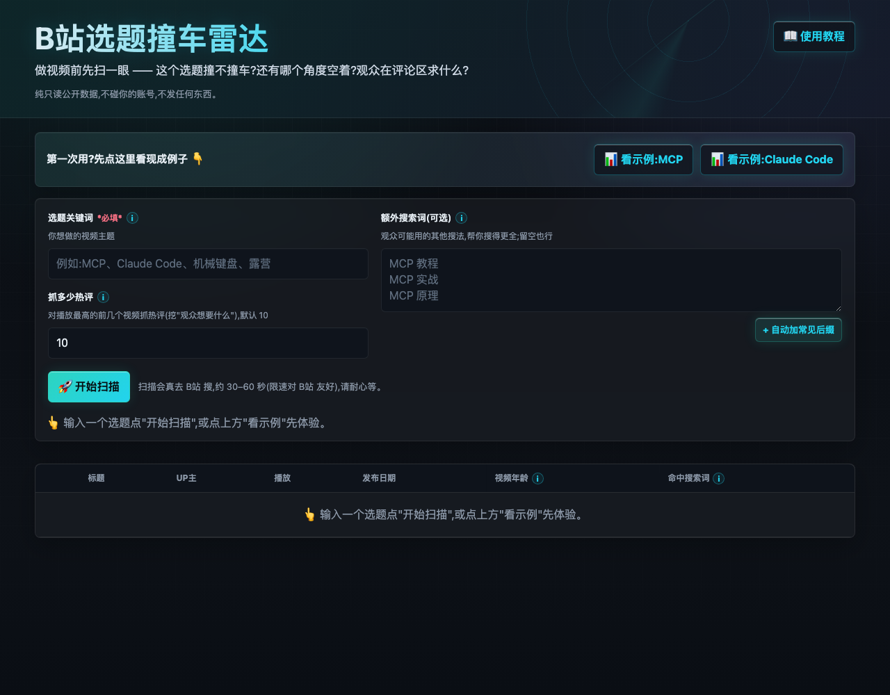
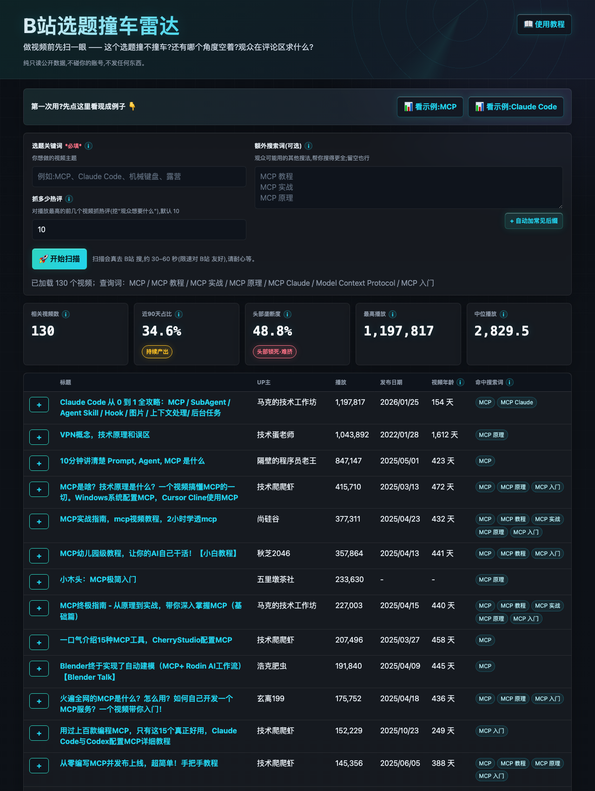

# 使用教程 📖

手把手教你用「B站选题撞车雷达」。**全程只读公开数据,不用登录 B站、不发任何东西。**

---

## 第 0 步:启动

**Mac**:在 Finder 里找到 `scripts/start.command`,**双击**它,等浏览器自动打开。

**命令行**(Mac / Linux):
```bash
cd bili-topic-radar
./scripts/start.sh
```

看到浏览器打开 **http://127.0.0.1:8848** 就成了。
> 想停掉:回到那个终端窗口按 `Ctrl + C`。

如果页面打不开,多半是代理拦了 localhost —— 把 `127.0.0.1` 加进你代理软件的「不走代理」白名单,或临时关一下代理。

---

## 第 1 步:先点示例,看个明白(不用等)

第一次用别急着扫,先点页面上方的 **「📊 看示例:MCP」** 或 **「📊 看示例:Claude Code」**。
这是我们提前跑好的真实数据,**秒加载**,让你先看清楚这工具能给你啥。



---

## 第 2 步:扫你自己的选题

在表单里填:

| 填哪 | 填啥 | 例子 |
|------|------|------|
| **选题关键词**(必填) | 你想做的视频主题 | `机械键盘`、`露营`、`Claude Code` |
| **额外搜索词**(可选,每行一个) | 观众可能用的其他搜法,帮你搜得更全 | `机械键盘 推荐`<br>`机械键盘 客制化` |
| **抓多少热评** | 对播放最高的前几个视频抓评论(挖需求用),默认 10 | `10` |

> 不知道额外搜索词填啥?点 **「+ 自动加常见后缀」**,它会自动补"教程/实战/入门"等。

点 **「🚀 开始扫描」**。它会真去 B站 搜,限速对 B站 友好,**约 30–60 秒**,耐心等。

---

## 第 3 步:读"竞争态势"(顶部 5 张卡)

每张卡都有个 ⓘ,**点一下看解释**。重点看两个:

- **近90天占比**:越高 = 这题还在火、新人也有机会(🔥上升期);越低 = 热度过了。
- **头部垄断度**:越高 = 流量被几个大 UP 占光、新人难出头(红色「锁死」);越低 = 流量分散、好进。

下面的**视频表**是所有同题视频,可按播放/日期排序,点每行的 **+** 看它的高赞评论。



---

## 第 4 步:让 AI 给建议(可选,需本机 Codex)

点 **「🤖 AI 智能分析」** 按钮,等约 **30–60 秒**(本机 AI 在思考),你会看到:

- **总判断徽章**:✅做 / ✏️改角度 / ⏳延后 / ⛔放弃 + 一句话理由
- **角度地图**:哪个角度挤爆了(🔴)、哪个还空着(🟢)
- **观众真需求**:从高赞评论挖出来的、能做成视频的真实需求(玩梗/吐槽/求资源这些假需求会被过滤掉),每条带评论原文 + 赞数 + 来源
- **3 个能做的选题**:每个带角度、给谁看、竞争度、最大的坑

> **没装 Codex?** 点 AI 按钮会提示你"需要本机 Codex",不影响前面的看板。
> 想用 AI:装 [Codex CLI](https://github.com/openai/codex) 并 `codex login` 登录一次即可,**不用配 key、不花钱**。

---

## 怎么读 AI 的建议(重要)

- 它会**诚实劝退**:这题没空子就直接说"别做/改角度",别嫌它泼冷水——这才是它的价值。
- 它的"观众真需求"**都挂着真实评论原文 + 赞数**,你可以自己点回去核实。
- 结论**仅供参考**,你比 AI 更懂你的频道,最终你拍板。

---

## 常见疑问

- **会不会封号?** 不会,只读公开数据,不登录不发东西。
- **搜出来有跑题的?** 广词会带噪声,AI 分析会自动剔除并在"数据提醒"里说明。
- **想换个选题?** 直接改关键词重新扫;或点另一个示例。

遇到问题或想要新功能,欢迎反馈。祝选题不再撞车 🎯
